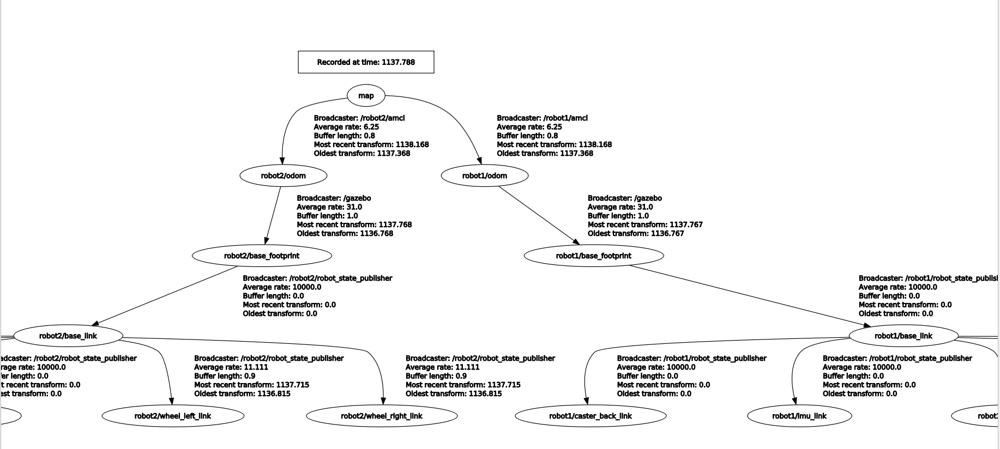
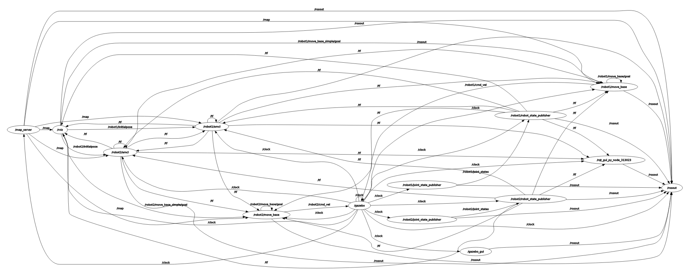

## Video 

Here is a short demonstration video showing the multi-TurtleBot3 running in Rviz:

## TF Tree

Here is the TF tree that represents the coordinate transformations between different frames:

## Node Graph

